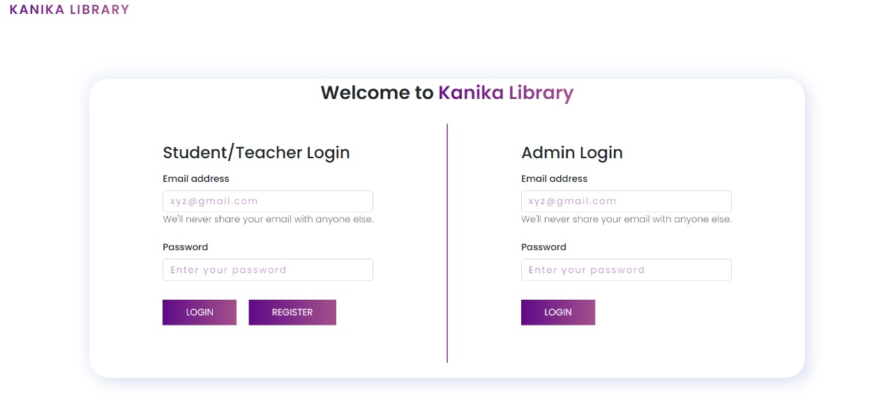
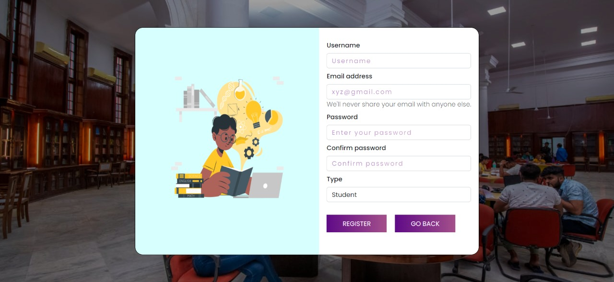
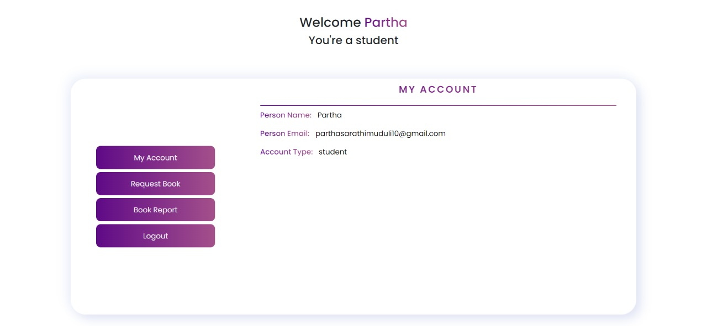

# Library Management System

 
<h2><b>This project is made by </b></h2>

<a href="https://parthasarathimuduli.netlify.app/">Partha Sarathi Muduli</a>

<h2>Project Description</h2>

  In this project there is 2 login section, one is <b>Student/Teacher login</b> and anohther is <b>Admin login</b>.
  Also, new student/teacher can register.   
  

<h3><b>Admin functionality</b></h3>

 
<ul>
  <li>Add Book</li>
  <li>Book Report</li>
  <li>Book Request</li>
  <li>Add Student</li>
  <li>Student Report</li>
  <li>Issue Book</li>
  <li>Issue Report</li>
</ul>
<h3>Student functionality</h3>

 
<ul>
  <li>My Account</li>
  <li>Book Report</li>
  <li>Book Request</li>
</ul>
