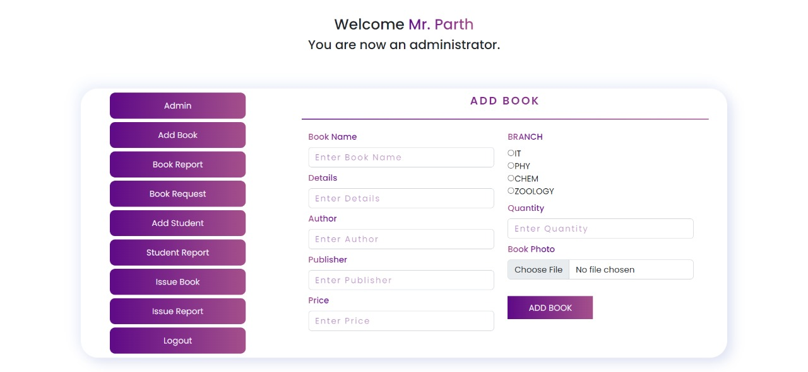

# Library Management System

 
<h2><b>This project is made by </b></h2>

<a href="https://parthasarathimuduli.netlify.app/">Partha Sarathi Muduli</a>

<h2>Project Description</h2>

  In this project there is 2 login page, one is <b>Student/Teacher login</b> and anohther is <b>Admin login</b>.
  Also, new student/teacher can register.

<h3>Admin functionality</h3>
 
<ul>
  <li>Add Book</li>
  <li>Book Report</li>
  <li>Book Request</li>
  <li>Add Student</li>
  <li>Student Report</li>
  <li>Issue Book</li>
  <li>Issue Report</li>
</ul>
<h3>Student functionality</h3>
 
<ul>
  <li>My Account</li>
  <li>Book Report</li>
  <li>Book Request</li>
</ul>

<h2>Steps for creating Database for this project:-</h2>
<h3>Step 1:</h3>
<ul>
  <li>Create Database <i><b>library_management_system</b></i> on <u>http://localhost/phpmyadmin</u></li>
</ul>
<h3>Step 2:</h3>
<h4>Create Tables</h4>
<h5><i>NOTE* make sure to create the table columns on the same order which i've mentioned here.</i></h5>
<ul>
  <li>admin  
    <i>add these columns to this table</i>
    <ul>
      <li>id (primary key)</li>
      <li>email</li>
      <li>pass</li>
      <li>type</li>
    </ul>
  </li>
  <li>book  
    <i>add these columns to this table</i>
    <ul>
      <li>id (primary key)</li>
      <li>bookname</li>
      <li>bookdetail</li>
      <li>bookauthor</li>
      <li>bookpub</li>
      <li>bookprice</li>
      <li>bookphoto</li>
      <li>branch</li>
      <li>bookavail</li>
      <li>bookquantity</li>
      <li>bookrent</li>
    </ul>
  </li>
  <li>bookrequest  
    <i>add these columns to this table</i>
    <ul>
      <li>id (primary key)</li>
      <li>userid (from userdata table)</li>
      <li>bookid (from book table)</li>
      <li>username</li>
      <li>usertype</li>
      <li>bookname</li>
      <li>issuedays</li>
    </ul>
  </li>
  <li>issuebook  
    <i>add these columns to this table</i>
    <ul>
      <li>id (primary key)</li>
      <li>userid (from userdata table)</li>
      <li>issuename</li>
      <li>issuebook</li>
      <li>issuetype</li>
      <li>issuedays</li>
      <li>issuedate</li>
      <li>issuereturn</li>
      <li>fine</li>
    </ul>
  </li>
  <li>userdata  
    <i>add these columns to this table</i>
    <ul>
      <li>id (primary key)</li>
      <li>name</li>
      <li>email</li>
      <li>pass</li>
      <li>type</li>
    </ul>
  </li>
</ul>